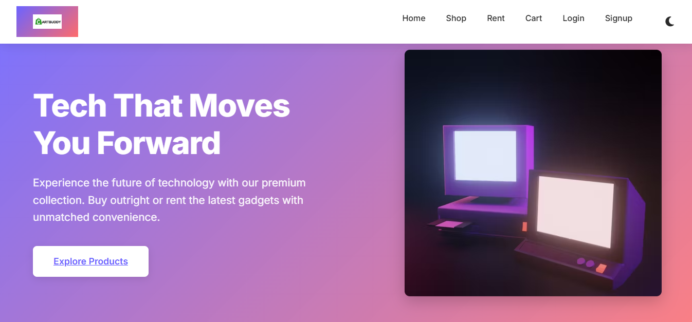
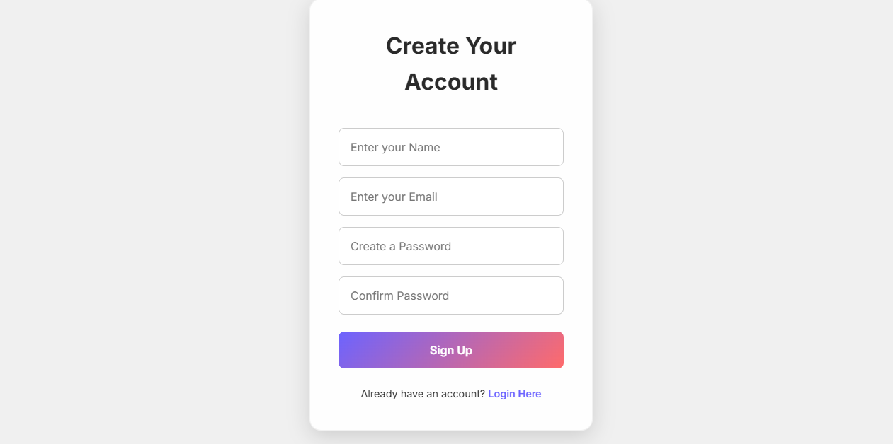
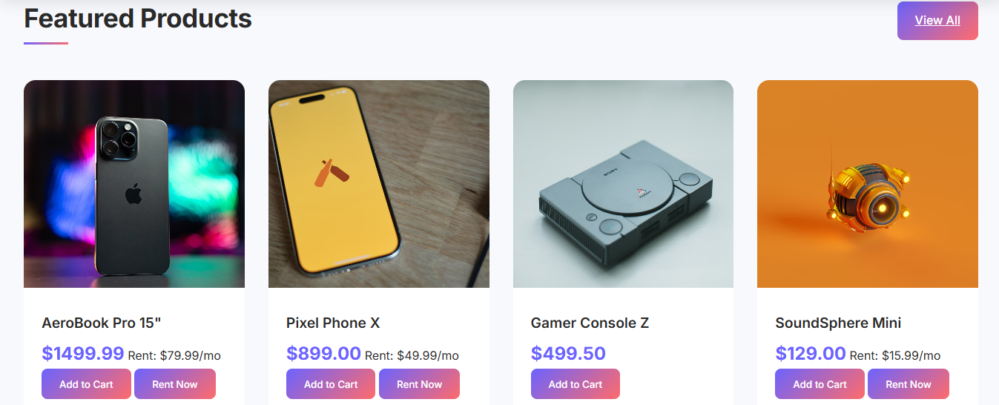
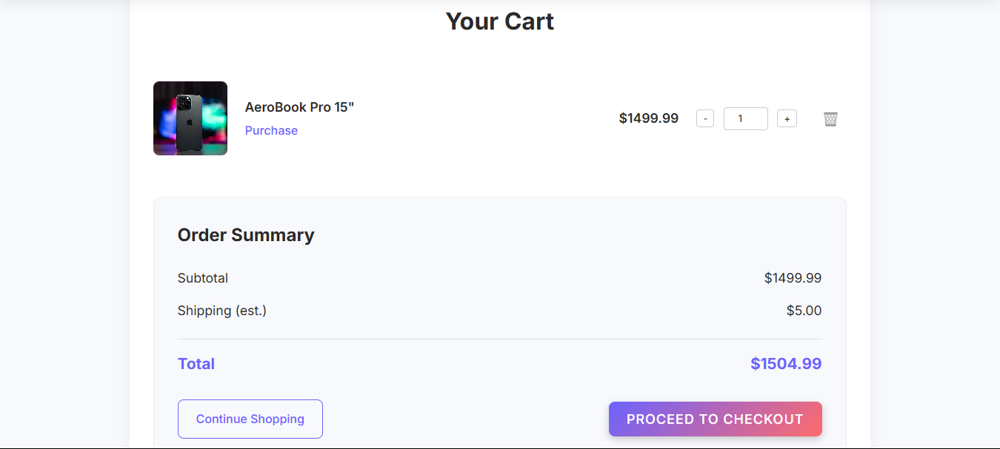

# CartBuddy

**Tech That Moves You Forward**  
Experience the future of technology with our premium collection.  
Buy outright or rent the latest gadgets with unmatched convenience.

---

## 🛍️ About

**CartBuddy** is a modern technology commerce platform designed to make premium gadgets accessible to everyone—whether you're looking to own the latest devices or rent them for short-term needs.

We combine the power of flexibility with premium service to deliver a seamless shopping experience tailored to your tech lifestyle.

---

## Screenshots
**Homepage**


**Sign Up Page**


**Products Page**


**Cart Page**



## ✨ Features

- 🔄 **Flexible Options**: Buy or rent tech based on your needs and budget.
- 🛡️ **Premium Quality**: Only top-notch, reliable gadgets from trusted brands.
- 🚚 **Fast Delivery**: Quick and secure doorstep delivery.
- 📦 **Renting Facility**: Affordable rental options for the latest technology.
- 📱 **Mobile-Responsive Interface**: Shop from anywhere on any device—designed to look great and work fast.
- 🔐 **Secure Checkout**: Ensuring customer data and payment are handled with care.
- 🪄 **Version Control**: Git & GitHub

---

## 🛠️ Tech Stack

- **Frontend**: HTML, CSS, JavaScript

---

## 🚀 Getting Started

1. Clone the repository:
   ```bash
   git clone https://github.com/yourusername/cartbuddy.git

## 👥 Collaborators
- Shoaib Malik (Team Lead)
- Shivani Modi
- Srishti
- Shlok


## 🙏 Acknowledgements
Thanks to our faculty and peers for continuous support and Source Code Management guidance.